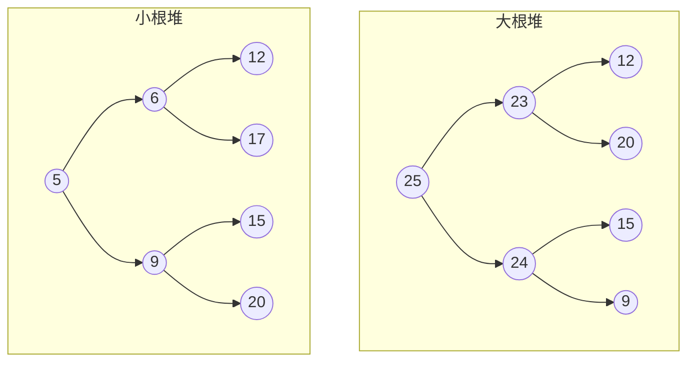

# Algorithm Notes
<h1>目录：</h1>
 <li>[位运算](#bitmap)</li>
# [时间、空间复杂度](https://www.bilibili.com/video/BV1JV411G7De/?spm_id_from=333.999.0.0&vd_source=3e78417e114be9d4af93565f11845737)

# 位运算
<h2 id="bitmap"></h2>
## 位图
小技巧 ： 向上取整可以写成（a + b - 1）/ b
<p>位图原理：
其实就是用bit组成的数组来存放值，用bit状态1、0代表存在、不存在，取值和存值操作都用位运算限制是必须为连续范围且不能过大。好处是极大的节省空间，因为1个数字只占用1个bit的空间。</p>
```c++
class Bitmap(){
	int* bits;
	Bitmap(int n){ // 申请位图
		bits = new int[(n + 31)/32];
	}
	~Bitmap(){
		delete bits[];
	}
	// 成员方法
	void add(int n){ // 将n加入位图，即把对应位置变成 1
		bits[n/32] |= 1 << (n % 32);
	}
	void remove(int n){
	// 此处如果使用异或会导致当 n 原本就不存在的话经过remove 变成存在 见下面reverse
		bits[n/32] &= ~(1 << (n % 32)); 
	}
	// 存在变不存在，不存在变存在
	void reverse(int n){
		bits[n/32] ^= 1 << (n % 32);
	}
	bool contain(int n){
		return ((bits[n/32] >> (n % 32)) & 1) == 1; 
	}
	
}
```
## [异或运算的骚操作](https://www.bilibili.com/video/BV1LN411z7nu/?spm_id_from=333.999.0.0)

### 1、交换两个数
```C++
a = a ^ b
b = a ^ b
a = a ^ b
```
### 2、不用任何判断和比较操作，返回两数的最大值
```c++
int flip(n){ // 1 变 0， 0 变 1
	return n ^ 1;
}
int sign(int n){ // 判断该数的符号位，非负返回 1 ，负数返回 0
	return flip(n >> 31);
}
int getMax1(int a, int b){ // 有溢出风险 当 a b 符号不一样是会溢出
	int c = a - b;
	int returnA = sign(c); // c < 0,则a大，反之
	int ruturnB = flip(returnA); // returnA 是 1 ，b 则为 0，反之
	return a * returnA + b * returnB; // 省去判断操作
}

int getMax2(int a, int b){
	int c = a - b;
	// 得出a b c 的正负
	int sa = sign(a);
	int sb = sign(b);
	int sc = sign(c);
	int diffAB = sa ^ ab; // 符号不一样则为 1，一样为 0
	int sameAB = flip(diffAB); // 符号一样为 1， 不一样 为 0
	returnA = diffAB * sa + sameAB * sc; // + 号两边只有一个成立
	returnB = flip(returnA);
	return a * returnA + b * returnB;
}

```
解释 ： 如果a  b 符号一样，没有溢出风险，
			如果a  b符号不一样，返回正数的那一个
### 3、缺失的数
0 ~ 10 中缺了·一个，找出缺的那个数
```c++
int missingNum(int arr[]){
// nums 长度是10， 0 ~ 10 中缺了一个
	int eorALL = 0, eorHas = 0;
	for(int i = 0; i < arr.size(); i++){
		eorALL ^= i;
		eorHas ^= arr[i]; 
	}
	eorALL ^= arr.size();
	return eorALL ^ eorHas;
}

```

## Brian Kernighan 算法
<h3>此算法是指取得二进制位最右侧的 1 所代表的数：n & -n</h3>

## [位运算实现加减乘除](https://www.bilibili.com/video/BV1up4y1g7d8/?spm_id_from=333.999.0.0&vd_source=3e78417e114be9d4af93565f11845737)
### 加
**step1 : 将两数无进位相加（异或）
step2 : 得到两数的进位信息**
```c++
int add(int a, int b){
	int ans = a;
	while(b != 0){
		ans = a ^ b;
		// 进位信息
		b = (a & b) << 1;
		a = ans;
	}
	return ans;
}
```
### 减
减法即为被减数加上减数的相反数（相反数 = 原数取反 + 1）
```c++
int minus(int a, int b){
	return add(a, negative(b));
}

int negative(int b){
	return add(~b, 1);
}
```

### 乘法
```c++
int multiply(int a, int b){
	int ans = 0;
	while(b != 0){
		// 考察b 的最右一位 是不是 1
		if(b & 1 == 1){
			ans = add(ans, a);
		}
		a <<= 1;
		b >>= 1;
	}
	return ans;
}
```

# 数据结构

## 链表

## 串
## 树

## 图
## 线性表
# 排序算法

## [三傻排序 -- 选择、冒泡、插入](https://www.bilibili.com/video/BV12P41147to/?spm_id_from=333.999.0.0)

**比较行为浪费了大量时间——比较了近乎所有数组只确定了一个位置**
### 选择排序

**选择排序一句话：** i ~ n-1的范围上，找到最小值并放在 i 位置上，然后在 i + 1 ~ n - 1范围上继续上述操作
***时间复杂度：*** $O(n^2)$

```c++
// 定义交换函数
void swap(int arr[], int i, int j){
	int temp = arr[j];
	arr[j] = arr[i];
	arr[i] = temp;
}
// 选择排序
void selectionSort(int arr[], int len){// len表示数组大小
	if(arr == NULL || len < 2){
		return ;
	}
	for(int i = 0; i < len; i++){
		int minIndex = i; // 存储最小值下标
		for(int j = i + 1; j < len; j++){
			if(arr[j] < arr[minIndex]){
				minIndex = j;
			}
		}
		swap(arr, i, j);
	}
}

```

### 冒泡排序

***冒泡排序一句话：*** 在 0~i 的范围内，相邻两个位置较大的滚过去，最后最大的数来到 i 位置，然后在0~ i 位置重复上述操作

***时间复杂度：*** $O(n^2)$

```c++
// 定义交换函数
void swap(int arr[], int i, int j){
	int temp = arr[j];
	arr[j] = arr[i];
	arr[i] = temp;
}

// 冒泡排序
void bubbleSort(int arr[], int len){// len表示数组大小
	if(arr == NULL || len < 2){
		return ;
	}
	for(int end = len - 1; end > 0; end--){
		for(int i = 0;i < end - 1; i++){
			if(arr[i] > arr[i+1]){
				swap(arr,i, i+1);
			}
		}
	}
}
```

### 插入排序

***插入排序一句话：*** 0~i 的范围上已经有序，新来的数从右向左滑到不能在小的位置插入，，然后继续

***时间复杂度：*** $O(n^2)$

```c++
// 定义交换函数
void swap(int arr[], int i, int j){
	int temp = arr[j];
	arr[j] = arr[i];
	arr[i] = temp;
}
//插入排序
void insertionSort(int arr[], int len){// len表示数组大小
	if(arr == NULL || len < 2){
		return ;
	}
	for(int i = 1; i < len; i++){
		for(int j = i - 1; j >= 0 && arr[j] > arr[j+1]; j--){
			swap(arr, j, j+1);
		}
	}
}
```

## [归并排序](https://www.bilibili.com/video/BV1wu411p7r7/?spm_id_from=333.788.recommend_more_video.-1&vd_source=3e78417e114be9d4af93565f11845737) 递归实现 & 非递归实现

**1. 左部分排好序、右部分排好序、利用merge过程让左右整体有序**
**2. merge过程:谁小拷贝谁，直到 左右两部分所有的数字耗尽，拷贝回原数组递归实现和非递归实现**
**3. 时间复杂度0(n * logn)**
**4. 需要辅助数组，所以额外空间复杂度0(n)归并排序为什么比0(n2的排序快?因为比较行为没有浪费**


**时间复杂度：** T(n) = 2 * T(n/2) + O(n) 由master公式推得时间复杂度为(n * logn) 
**空间复杂度：** O(n)
***递归实现：***
```c++
static arr[MAXN]; // 待排序的数组
const MAXN = 5000; // 按需更改
int help[MAXN]； // 辅助数组
void merge(int l, int m, int r){
	int i = l;
	int b = m + 1;
	int a = l;
	// 左右都没超边界
	while(a <= m && m+1 <= r){
		help[i++] = arr[a] > arr[b]? arr[a++] : arr[b++];
	}
	while(a <= m){
		help[i++] = arr[a++];
	}
	while(b <= r){
		help[i++] = arr[b++];
	}
	// 更新原数组
	for(int j = l; j <= r; j++){
		arr[l++] = help[l];
	}
}
// merge过程时间复杂度为O(n)
void mergeSort(int l, int r){
	if(l == r) reutrn ;
	int mid = l + (r-l)/2;
	mergeSort(l, mid);
	mergeSort(mid + 1, r);
	merge(l, mid, r);
}

```

***非递归实现：***
```c++
static arr[MAXN]; // 待排序的数组
const MAXN = 5000; // 按需更改
int help[MAXN]； // 辅助数组
void merge(int l, int m, int r){
	int i = l;
	int b = m + 1;
	int a = l;
	// 左右都没超边界
	while(a <= m && m+1 <= r){
		help[i++] = arr[a] > arr[b]? arr[a++] : arr[b++];
	}
	while(a <= m){
		help[i++] = arr[a++];
	}
	while(b <= r){
		help[i++] = arr[b++];
	}
	// 更新原数组
	for(int j = l; j <= r; j++){
		arr[l++] = help[l];
	}
}

// merge过程时间复杂度为O(n)
void mergeSort(int len){ // 数组长度
	for(int l, m, r step = 1; step < len; step <<= 1){
		l = 0;
		while(l < len){
		if(m + 1 >= len) // m + 1 > len - 1
			m = l + step -1, len;
			r = min(l + 2*step - 1, len - 1);
		}
		merge(l, m, r);
		l = r + 1;
	}
}
```

## 随即快速排序

## 堆排序

**堆结构** ： 定义在顺序数组的完全二叉树 满足 父节点索引 = （子节点 - 1）/2 = （i - 1）/ 2 **大根堆** 和 **小根堆**

<h2>堆排序：建堆从顶到底（nlogn）</h2>

```c++
void swap(int arr[], int i, int j){
	int temp = arr[i];
	arr[i] = arr[j];
	arr[j] = temp;
}

// 向上调整 前提是未插入之前已经是一个大根堆了
// arr[i]是新来的数，向上看，如果大于父节点，则交换 // 时间复杂度NlogN
void heapInsert(int arr[], int i){ 
	while(arr[i] > arr[(i-1)/2]){
		swap(arr, i, (i-1)/2);
		i = (i-1)/2;
	}
}
// 向下调整,排序过程  // 时间复杂度NlogN
void heapify(int arr[], int i, int size){
	int l = i*2 + 1;
	while(l < size){
		int best = l + 1 < size && arr[l+1] > arr[l] ? l + 1: l; // 左右子树较大的
		best = arr[i] > arr[best] ? i : best;
		if(best == i) break;
		swap(arr, i, best);
		i = best;
		l = i*2 + 1;
	}
}

// 堆排序全过程 
void heapSort(int arr[], int size){
	for(int i = 0; i < size;i++){
		heapInsert(arr, i); 
	}
	while(size > 1){
		swap(arr, 0, --size);
		heapify(arr,0,size);
	}
}
```
<h2>堆排序：建堆从底到顶（nlogn）</h2>
```C++
// 优化了键堆过程 ，时间复杂度 O（N）
void heapSort(int arr[], int size){
	for(int i = size - 1; i >= 0;i--){
		heapify(arr, );
	}
	while(size > 1){
		swap(arr, 0, --size);
		heapify(arr,0,size);
	}
}
```

## [非比较排序：基数排序](https://www.bilibili.com/video/BV1Lh4y1c7Aw/?spm_id_from=333.999.0.0&vd_source=3e78417e114be9d4af93565f11845737)


<h3>非比较排序需要严格的数据特征</h3>
<h4>计数排序</h4>
假设有10玩个数字需要排序，但是这写数字都在【1，60】范围内，则可以遍历数组，使用辅助数组记录每个数出现的次数，最后自己生成排序后的数组
<h4>基数排序</h4>

1. 找到待排序数组中最大的数字，并确定其位数，记为 `maxDigit`。
2. 创建 10 个桶（0 到 9），用于存放待排序元素。**桶的数量依照数字的进制来设定**
3. 对每一位（从个位到最高位），执行以下操作：
    - 将待排序数组中的元素按照当前位的值放入对应的桶中。
    - 按照桶的顺序依次取出所有元素，放回原数组中。
4. 重复第 3 步，直到排序完成所有位数。
5. 最终，待排序数组就会按照从小到大的顺序排列。
```c++
const int Base = 10; // 进制，默认为10进制

static int help[5001]; // 辅助数组

static int cnt[Base];

void radixSort(int arr[],int size, int bits){ // bit 是最大数占几位

    for(int offset = 1; bits > 0; offset *= Base,bits--){

        memset(cnt,0,sizeof(cnt));

        // 统计每个数各位

        for(int i = 0; i < size; i++){

            cnt[(arr[i] / offset) % Base]++;

        }

        // 将cnt中的词频改成前缀和形式

        for(int i = 1;i < Base; i++){

            cnt[i] = cnt[i] + cnt[i-1];

        }

        // 按照各位词频 将arr数组放入help 数组中排序

        for(int i = size - 1; i >= 0; i--){

            // 前缀分区技巧，从后遍历不影响稳定性，也可以说是先进桶的先出桶

            help[--cnt[(arr[i]/offset)%Base]] = arr[i];

        }

        for(int i = 0; i < size; i++){

            arr[i] = help[i];

        }

    }

}
```
# 递归和master公式
任何递归都可以变成非递归，自己压栈

**master公式：** 限定：所有子问题的规模相同。$T(N) = a * T(\frac{N}{b})+O(N^{c})$  (a为子过程调用了几次递归函数，b为规模减少的倍数，如每次减少1/2 ，则b = 2， c 所属整体为其余过程的时间额外时间复杂度)
1. 如果 $log_{a}b > c$ 那么时间复杂度为：$N^{log_{a}b}$ 
2.  如果 $log_{a}b < c$ 那么时间复杂度为：$N^{c}$ 
3.  如果 $log_{a}b == c$ 那么时间复杂度为：$N^{c} * logN$ 
4. 例外的： $T(N) = 2*T(\frac N 2) + O(N*log n)$ 时间复杂度为：$N*(logn)^2$ ]

# 求最大公因数
```c++
int gcd(int a, int b) {
	return b == 0? a: gcd(b, a % b);
}

// 那么最小公倍数就为 ： 
int lcm(int a, int b) {
	return a / gcd(a, b) * b;
}
```
例题：[第N个神奇数字](https://leetcode.cn/problems/nth-magical-number/description/)
1 ~ x 中有多少个神奇数字？ $\frac x a + \frac x b - \frac x {lcm(a, b)}$  

# 同余原理

对于某些问题([第N个神奇数字](https://leetcode.cn/problems/nth-magical-number/description/))， 最后要求返回最终结果对某个数(假设为m)取模的结果。也为解决 long long 溢出。
有如下定理：
		1、加法同余原理 $(X_1 + X_2+ X_3 +X_4) \% m = (X_1\%m + X_2\%m+X_3\%m+X_4\%m)\%m = ((X_1 + X_2)\%m+X_2)\%m....$
		2、乘法同余原理(同加法)
		3、减法同余原理 (加m为不取负数)$(X_1 - X_2- X_3 -X_4) \% m = (X_1\%m - X_2\%m-X_3\%m-X_4\%m+m)\%m$   
		4、除法同余原理 -> 在一些特定的情况下，我们可以使用逆元来解决除法同余的问题


# 前缀树  (字典树) -- Trie


# 一维差分和等差数列差分

<h3>不支持边插入边查询</h3>

 
> [!important] 题目
> 航班预订统计这里有 n 个航班，它们分别从 1 到 n 进行编号。有一份航班预订表 bookings ，表中第 i 条预订记录 bookings[i] = [firsti, lasti, seatsi]意味着在从 firsti 到 lasti
包含 firsti 和 lasti ）的 每个航班 上预订了 seatsi 个座位。请你返回一个长度为 n 的数组 answer，里面的元素是每个航班预定的座位总数。

```c++
vector<int> corpFlightBookings(vector<vector<int>>& bookings, int n) {

        vector<int> ans(n+1, 0);

        for (auto& book: bookings) {
            ans[book[0]-1] += book[2];
            ans[book[1]] -= book[2];
        }

        for (int i = 1; i < n; i++) {
            ans[i] += ans[i-1];
        }
        ans.pop_back();
	    return ans;
    }
```


> [!important] 等差数列
>等差数列差分问题描述：
一开始1~n范围上的数字都是0。接下来一共有m个操作。
每次操作：l~r范围上依次加上首项s、末项e、公差d的数列最终1~n范围上的每个数字都要正确得到

```c++
void set(int l, int r, int s, int e, int d) {
  arr[l] += s;
  arr[l + 1] += d - s;
  arr[r + 1] -= d + e;
  arr[r + 2] += e;
  }

void build() {
// 两边前缀和
    for (int i = 1; i <= n; i++) {
    arr[i] += arr[i - 1];
    }

	for (int i = 1; i <= n; i++) {
	    arr[i] += arr[i - 1];
    }
}
```

等差数列差分的过程：
每个操作调用set方法
所有操作完成后在arr上生成两遍前缀和，即调用build方法
arr里就是最终1~n范围上的每个数字

# 二维前缀和、二维差分

## 二维前缀和

```C++
目的是预处理出一个结构，以后每次查询二维数组任何范围上的累加和都是O(1)的操作

1 根据原始状况，生成二维前缀和数组sum，
   sum[i][j]: 代表左上角(0,0)到右下角(i,j)这个范围的累加和
   sum[i][j] += sum[i][j - 1] + sum[i - 1][j] - sum[i - 1][j - 1];
	
2 查询左上角(a,b)到右下角(c,d)这个范围的累加和
   sum[c][d] - sum[c][b-1] - sum[a-1][d] + sum[a-1][b-1];

3 实际过程中往往补第0行、第0列来减少很多条件判断。
```


# 二分答案法

<h6>
<h6>1）估计 最终答案可能的范围 是什么，可以定的粗略，反正二分不了几次 </br>
<h6>2）分析 问题的答案 和 给定条件 之间的 单调性，大部分时候只需要用到 自然智慧</br></h6>
<h6>3）建立一个f函数，当答案固定的情况下，判断 给定的条件是否达标 </br
<h6>4）在 最终答案可能的范围上不断二分搜索，每次用f函数判断，直到二分结束，找到最合适的答案</br>
<h6>核心点：分析单调性、建立f函数
</h6>

例题：
[https://leetcode.cn/problems/koko-eating-bananas/](https://leetcode.cn/problems/koko-eating-bananas/)
[https://leetcode.cn/problems/split-array-largest-sum/](https://leetcode.cn/problems/split-array-largest-sum/)
[https://www.nowcoder.com/practice/7037a3d57bbd4336856b8e16a9cafd71](https://www.nowcoder.com/practice/7037a3d57bbd4336856b8e16a9cafd71)
[https://leetcode.cn/problems/find-k-th-smallest-pair-distance/](https://leetcode.cn/problems/find-k-th-smallest-pair-distance/)
[https://leetcode.cn/problems/maximum-running-time-of-n-computers/](https://leetcode.cn/problems/maximum-running-time-of-n-computers/)
https://leetcode.cn/problems/maximum-running-time-of-n-computers/

# 分解质因数

```c++
class Solution {
public:
    int distinctPrimeFactors(vector<int>& nums) {
        unordered_set<int> set;
        for (int num: nums) {
            // 处理能够分解的数
            for (int i = 2; i * i <= num; i++) {
                if (num % i == 0) {
                    set.insert(i);
                    num /= i;
                    while (num % i == 0) {
                        num /= i;
                    }
                }  
            }
            // 处理本身就是质数的数 如： 2 3 5
            if (num > 1) {
                set.insert(num);
            }
        }
        return set.size();
    }
};
```
