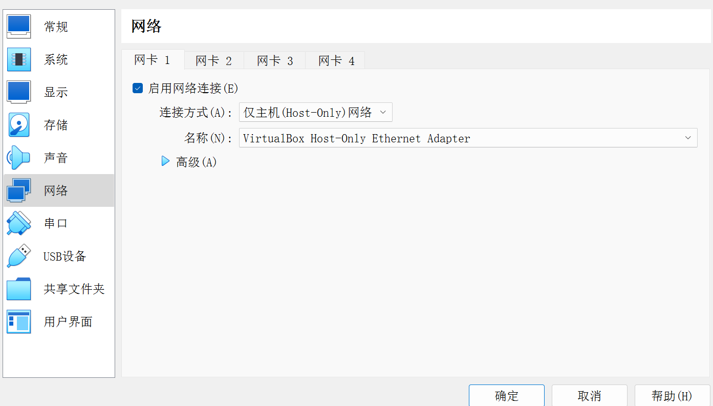
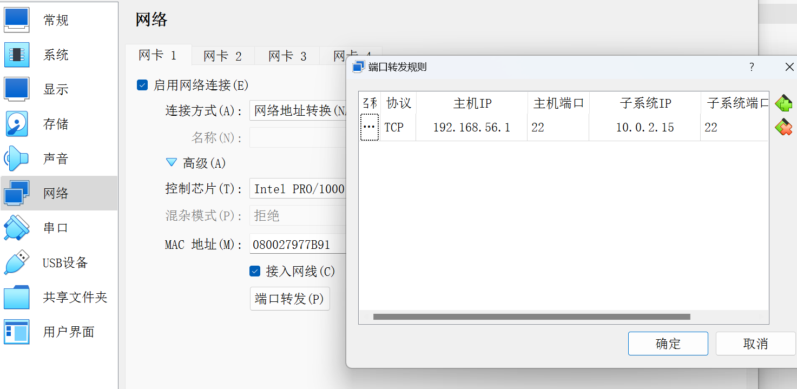

# Hadoop

- [Java安装与配置环境变量](#Java安装与配置环境变量)
- [Hadoop安装与配置](#Hadoop安装与配置)
- [伪分布式配置](#伪分布式配置)
- [分布式集群配置](#分布式集群配置)
- [SSH配置](SSH配置)

## Java安装与配置环境变量
由于hadoop集群是用Java编写的，故想运行 **hadoop** 必须先安装 **Java** 环境， 安装方法如下：

***方法一：***
	直接使用各自Linux发行版的包管理器安装，如 Debian 和 Ubuntu 的 **apt 或 apt-get** , ArchLinux的**pacman**，Centos 的 **yum** 。该方法较为简单，请自行查阅自己系统的安装方式。

 ***方法二：***
	官网自行下载Java压缩包，如果你的Linux有浏览器，可以在浏览器中直接下载。若没有，可在 Windows 中下载，然后借用 ssh 传至 Linux 虚拟机中（或实体机）具体 SSH 配置请查阅 [SSH配置](#SSH配置)
		 在Windows中打开powershell或cmd，输入如下命令：即可将文件传至Linux中的 home 目录中
```powershell
scp path/to/Java user@xxx.xxx.xxx.xxx:~/
# 例如：
scp ./jdk-11.0.2.tar.gz hadoop@192.168.16.100:~/
```
随后即可在Linux中解压安装包，并配置环境变量，命令如下：
```shell
# 首先来到压缩包所在目录 如 ~/
tar -zxvf path/to/Java.tar.gz -C path/to/Java
```
`path/to/Java.tar.gz`代表Java压缩包的路径，相对或绝对路径均可。
`-C` 后的路径是你要将压缩吧解压到的路径，可根据需要自行更改。本文将安装到 `/opt/Java`中，因此，上方命令应 个性化 为 ： `tar -zxvf ./jdk-11.0.2_linux-x64_bin.tar.gz -C /opt/Java`

如下所示：


**接着配置环境变量**：
配置环境变量需要修改 home 目录下的 .bashrc 文件，某些系统可能还存在~/.bash_profile， 建议修改 `~/.bash_profile`， 如果没有，请修改 `~/.bashrc
```shell
# 来到家目录 ~
cd ~
nvim .bash_profile
# 在文件最后写下如下命令
JAVA_HOME=/opt/Java/jdk-11.0.2
export PATH=$PATH:$JAVA_HOME/bin
```
关于`JAVA_HOME` 请赋值为自己JAVA安装的路径，切忌照葫芦画瓢
输入 `java -version` 查看是否安装成功

## Hadoop安装与配置

根据上面提到的 Java 安装方法二，同理发送文件到Linux，下面仅给出命令， 考虑到书上将hadoop安装到`/usr/local`中，以下命令将如此实现，但本人是将 hadoop安装至 `/opt` 中。
```shell
tar -zxvf path/to/hadoop.tar.gz -C /usr/local/
# 接着进入 /usr/local/ 目录中
cd /usr/local/
# 按书中所述，改名，以便操作
chown -R usrname ./hadoop
```
`chown`的意思为`change owner`, `-R` 意味着 `recursive`递归，即将 `./hadoop`中所有文件都更改所有者权限。注意`usrname`请自行更改。
tips：如遇到不懂的命令，可以使用 `help command` 或者 `man command` 查看帮助文档

完成以上操作基本上不会出现问题，使用下方命令查看是否安装成功
```shell
# 进入hadoop安装目录
cd /usr/local/hadoop
./bin/hadoop version
```
如遇到报错`ERROR: JAVA_HOME is not set and could not be found.` 请修改`./etc/hadoop/hadoop-env.sh` 在最后加上 
```shell
export JAVA_HOME=/opt/Java//opt/Java/jdk-11.0.2
```
注意：JAVA_HOME 内容根据实际情况填写

完成上述步骤基本已经安装完成。

## 伪分布式配置
由于书中案例给的足够详细，便在此不再赘述，请见 [厦门大学提供的文档](https://dblab.xmu.edu.cn/blog/2441/)

## 分布式集群配置

参考文档：</br>
[Hadoop集群安装配置教程](https://dblab.xmu.edu.cn/blog/2775/)
</br>
[Hdoop官方文档](https://hadoop.apache.org/docs/r3.3.6/hadoop-project-dist/hadoop-common/ClusterSetup.html)

为方便区分每一台机器，修改不同机器的主机名`/etc/hostname`， 然后再`/etc/hosts`文件中配置主机名与`IP`的映射。

与伪分布式一样，名车节点机器`Master`需要无密码登录本身和各数据节点`Slave`， 故需要将`Master`的公钥放在各`Slave`中
首先在`Master`中生成密钥对
```shell
# 生成密钥，建议选用 ed25519 算法
ssh-keygen -t ed25519
cat id_ed25519.pub >> authorized_keys
```
这样 `Master` 就可以连接自己了，但还需要连接 `Slave` ,即将公钥保存在 `Slave` 中的 `autorized_keys` ，首先将公钥拷贝到 `Slave` 中，在进行上述操作
```shell
scp ~/.ssh/id_ed25519.pub hadoop@Slave1:~/
```
然后在 `Slave1` 中修改 `authorized_keys` 
```shell
cat ~/id_ed25519.pub >> ~/.ssh/authorized_keys
rm ~/id_ed25519.pub    # 用完以后就可以删掉
```
可以在 `Master` 中 `ssh hadoop@Slave1` 验证是否成功。

## SSH配置

由于VMWare的NAT模式的 `ip` 地址默认是以`192.168.xxx.xxx`形式配置，故不在此介绍。

VirtualBox默认NAT配置`IP`为`10.0.xxx.xxx`,虽然也是局域网，但不知出于何种原因无法在主机上`SSH`连接，可以在网络连接设置中改为仅主机(Host-Only)

或者在高级设置中进行如下设置：

此时在windows中输入，即可远程操作Linux。
```shell
ssh username@192.168.56.1
```
如遇到问题，可修改`/etc/ssh_config`配置文件
